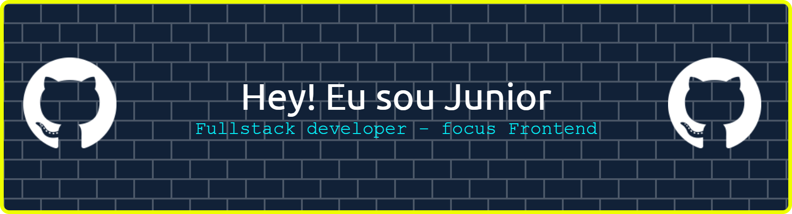

## Conecte-se comigo 👦

   

## Habilidades
<table><tr><td valign="top" width="50%">

### Frontend  

  
  
  
  
  
  
  
  
  
  
  
  
  
  

</td><td valign="top" width="50%">

### Backend  

  
  
  
  
  
  
  
  
  

>

</td></tr></table>  

### Filosofia de Desenvolvimento
- Acredito na importância do desenvolvimento contínuo e aprendizado constante
- Comprometido em escrever código limpo e eficiente

## Interesses e Hobbies
- Programação e desenvolvimento.
- Jogos.
- animes

## GitHub Stats

## Citação Favorita
"Se você não luta, não pode ganhar!" 

